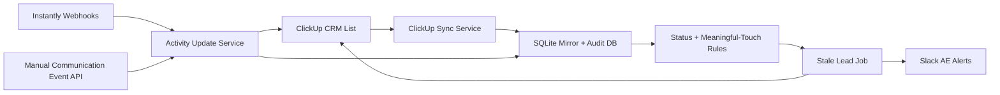

# Sales Support Agent

This FastAPI app handles post-creation sales support inside your existing ClickUp CRM workflow. It does not create new leads. It starts after the ClickUp task already exists and focuses on follow-through, stale-lead prevention, append-only activity logging, and AE reminders.

## What Phase 1 Includes

- Read-only ClickUp schema discovery against an existing CRM list
- Local mirror of ClickUp lead tasks for auditability and rule evaluation
- Manual communication event ingest for outbound, inbound, call, meeting, offer, and note events
- Native Instantly webhook ingest for email, reply, and meeting events
- Status-aware stale-lead scanning for your current ClickUp statuses
- Slack reminders to the assigned AE with dedupe
- SQLite-backed audit logs for every automation run and external write

## Folder Structure

```text
sales_support_agent/
  api/
  integrations/
  jobs/
  models/
  rules/
  services/
  config.py
  main.py
tests/
```

## Environment Variables

Required for ClickUp-backed execution:

- `CLICKUP_API_TOKEN`
- `CLICKUP_API_KEY` is also accepted as an alias
- `CLICKUP_LIST_ID`

Recommended for Slack alerts:

- `SLACK_BOT_TOKEN`
- `SLACK_CHANNEL_ID`
- `SLACK_AE_MAP_JSON`

Operational:

- `SALES_AGENT_INTERNAL_API_KEY`
- `SALES_AGENT_DB_URL`
- `CLICKUP_DISCOVERY_SAMPLE_SIZE`
- `CLICKUP_USE_DUE_DATE_FOR_FOLLOW_UP`
- `CLICKUP_DISCOVERY_SNAPSHOT_PATH`
- `STALE_LEAD_SCAN_MAX_TASKS`
- `STALE_LEAD_SCAN_SYNC_MAX_TASKS`
- `INSTANTLY_WEBHOOK_SECRET`
- `INSTANTLY_WEBHOOK_SECRET_HEADER`

Optional existing-field overrides:

- `CLICKUP_NEXT_FOLLOW_UP_FIELD_ID`
- `CLICKUP_COMMUNICATION_SUMMARY_FIELD_ID`
- `CLICKUP_LAST_MEETING_OUTCOME_FIELD_ID`
- `CLICKUP_RECOMMENDED_NEXT_ACTION_FIELD_ID`
- `CLICKUP_LAST_MEANINGFUL_TOUCH_FIELD_ID`
- `CLICKUP_LAST_OUTBOUND_FIELD_ID`
- `CLICKUP_LAST_INBOUND_FIELD_ID`

## Local Setup

```bash
cd /Users/davidnarayan/Documents/Playground/Lead-scraper
python3 -m venv .venv
source .venv/bin/activate
pip install -r requirements.txt
uvicorn sales_support_agent.main:app --host 0.0.0.0 --port 8010 --reload
```

## Suggested Startup Order

1. Run schema discovery to capture the real ClickUp field layout.
2. Review `runtime/clickup_schema_snapshot.json`.
3. Set any explicit field IDs needed in `.env`.
4. Run a dry sync.
5. Run a dry stale-lead scan.
6. Turn on Slack alerts and scheduled execution.

## API Endpoints

- `GET /`
- `GET /health`
- `POST /api/discovery/clickup-schema`
- `POST /api/clickup/sync`
- `POST /api/jobs/stale-leads/run`
- `POST /api/communications/events`
- `POST /api/integrations/instantly/webhook`

Protected POST routes accept `X-Internal-Api-Key` when `SALES_AGENT_INTERNAL_API_KEY` is configured.

## Example Requests

Discovery:

```bash
curl -X POST http://127.0.0.1:8010/api/discovery/clickup-schema \
  -H "Content-Type: application/json" \
  -H "X-Internal-Api-Key: $SALES_AGENT_INTERNAL_API_KEY" \
  -d '{"sample_size": 5}'
```

Stale-lead dry run:

```bash
curl -X POST http://127.0.0.1:8010/api/jobs/stale-leads/run \
  -H "Content-Type: application/json" \
  -H "X-Internal-Api-Key: $SALES_AGENT_INTERNAL_API_KEY" \
  -d '{"dry_run": true}'
```

Communication event:

```bash
curl -X POST http://127.0.0.1:8010/api/communications/events \
  -H "Content-Type: application/json" \
  -H "X-Internal-Api-Key: $SALES_AGENT_INTERNAL_API_KEY" \
  -d '{
    "task_id": "abc123",
    "event_type": "outbound_email_sent",
    "summary": "Sent first follow-up email after initial interest.",
    "recommended_next_action": "Check for reply tomorrow."
  }'
```

Instantly webhook:

```bash
curl -X POST http://127.0.0.1:8010/api/integrations/instantly/webhook \
  -H "Content-Type: application/json" \
  -H "X-Instantly-Webhook-Secret: $INSTANTLY_WEBHOOK_SECRET" \
  -d '{
    "event_type": "reply_received",
    "timestamp": "2026-03-13T16:00:00Z",
    "lead_email": "owner@example.com",
    "reply_text": "Interested. Can we speak next week?"
  }'
```

## System Diagram



## Active Status Logic

- Active enforcement: `CONTACTED COLD`, `CONTACTED WARM`, `WORKING QUALIFIED`, `WORKING NEEDS OFFER`, `WORKING OFFERED`, `WORKING NEGOTIATING`, `FOLLOW UP`
- Excluded from enforcement: `WON - ACTIVE`, `LOST`, `LOST - NOT QUALIFIED`, `WON - CANCELED`

## Notes

- ClickUp remains the source of truth.
- The local database exists only for audit logs, dedupe, and automation memory.
- Phase 1 uses Monday-Friday business-day logic and does not implement holiday calendars.
- Instantly can push conversation events directly into the native webhook endpoint.

## Team SOP

See the implementation and rollout playbook in [`sales_support_agent/TEAM_SOP.md`](/Users/davidnarayan/Documents/Playground/Lead-scraper/sales_support_agent/TEAM_SOP.md).

For a click-by-click production launch guide using the same stack pattern as the lead builder app, see [`sales_support_agent/LIVE_ROLLOUT_GUIDE.md`](/Users/davidnarayan/Documents/Playground/Lead-scraper/sales_support_agent/LIVE_ROLLOUT_GUIDE.md).
