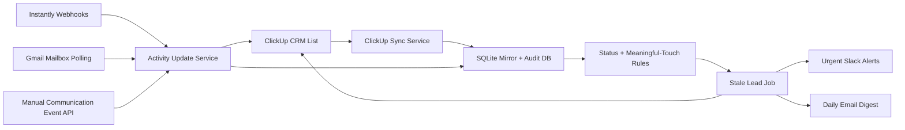

# Sales Support Agent

This FastAPI app handles post-creation sales support inside your existing ClickUp CRM workflow. It does not create new leads in the normal flow. It starts after the ClickUp task already exists and focuses on follow-through, stale-lead prevention, append-only activity logging, owner-directed reminders, daily digests, and mailbox-based signal intake.

## What Phase 1 Includes

- Read-only ClickUp schema discovery against an existing CRM list
- Local mirror of ClickUp lead tasks for auditability and rule evaluation
- Manual communication event ingest for outbound, inbound, call, meeting, offer, and note events
- Native Instantly webhook ingest for email, reply, and meeting events
- Gmail mailbox polling for reply and lead-source signal intake
- Amazon-first sales deck generation from one target Amazon ASIN/URL plus Helium 10 Xray exports
- First-party HTML deck export with shared Anata branding, stable URLs, and basic deck view tracking
- Status-aware stale-lead scanning for active `new`, `contacted`, and `working` statuses
- Concise Slack alerts for high-signal events only
- Daily SDR email digest with grouped action items and draft replies
- SQLite-backed audit logs for every automation run and external write

## Folder Structure

```text
sales_support_agent/
  api/
  integrations/
  jobs/
  models/
  rules/
  services/
  config.py
  main.py
tests/
```

## Environment Variables

Required for ClickUp-backed execution:

- `CLICKUP_API_TOKEN`
- `CLICKUP_API_KEY` is also accepted as an alias
- `CLICKUP_LIST_ID`

Recommended for Slack alerts:

- `SLACK_BOT_TOKEN`
- `SLACK_CHANNEL_ID`
- `SLACK_AE_MAP_JSON`

Operational:

- `SALES_AGENT_INTERNAL_API_KEY`
- `SALES_AGENT_DB_URL`
- `CLICKUP_DISCOVERY_SAMPLE_SIZE`
- `CLICKUP_USE_DUE_DATE_FOR_FOLLOW_UP`
- `CLICKUP_DISCOVERY_SNAPSHOT_PATH`
- `STALE_LEAD_SCAN_MAX_TASKS`
- `STALE_LEAD_SCAN_SYNC_MAX_TASKS`
- `STALE_LEAD_SLACK_DIGEST_ENABLED`
- `STALE_LEAD_SLACK_DIGEST_MENTION_CHANNEL`
- `STALE_LEAD_SLACK_DIGEST_MAX_ITEMS`
- `STALE_LEAD_IMMEDIATE_ALERT_URGENCIES`
- `SLACK_IMMEDIATE_EVENT_TYPES`
- `DAILY_DIGEST_ENABLED`
- `DAILY_DIGEST_EMAIL_TO`
- `DAILY_DIGEST_EMAIL_CC`
- `DAILY_DIGEST_SUBJECT_PREFIX`
- `DAILY_DIGEST_MAX_ITEMS`
- `GMAIL_API_BASE_URL`
- `GMAIL_OAUTH_TOKEN_URL`
- `GMAIL_ACCESS_TOKEN`
- `GMAIL_CLIENT_ID`
- `GMAIL_CLIENT_SECRET`
- `GMAIL_REFRESH_TOKEN`
- `GMAIL_USER_ID`
- `GMAIL_POLL_QUERY`
- `GMAIL_POLL_MAX_MESSAGES`
- `GMAIL_SOURCE_DOMAINS`
- `INSTANTLY_WEBHOOK_SECRET`
- `INSTANTLY_WEBHOOK_SECRET_HEADER`

Deck generator:

- `SHARED_BRAND_PACKAGE_PATH`
- `DECK_PUBLIC_BASE_URL`

Amazon-first deck intake:

- one target product input
  - Amazon ASIN, or
  - Amazon product URL
- one Helium 10 Xray competitor CSV
- one optional Helium 10 Xray keyword CSV
- offering toggles
  - `amazon`
  - `shopify`
  - `tiktok_shop`

Optional deck generator tuning:

- `AMAZON_PROFIT_API_BASE_URL`
- `DECK_COMPETITOR_REQUIRED_COLUMNS`
- `DECK_COMPETITOR_ALLOWED_COLUMNS`
- `DECK_REQUIRED_TEMPLATE_FIELDS`
- `SHOPIFY_REQUEST_TIMEOUT_SECONDS`
- `SHOPIFY_USER_AGENT`
- `AMAZON_SP_API_BASE_URL`
- `AMAZON_SP_API_REGION`
- `AMAZON_SP_API_MARKETPLACE_ID`
- `AMAZON_SP_API_LWA_CLIENT_ID`
- `AMAZON_SP_API_LWA_CLIENT_SECRET`
- `AMAZON_SP_API_REFRESH_TOKEN`

Legacy / currently unused:

- `AMAZON_SP_API_AWS_ACCESS_KEY_ID`
- `AMAZON_SP_API_AWS_SECRET_ACCESS_KEY`
- `AMAZON_SP_API_AWS_SESSION_TOKEN`

Website ops:

- `WEBSITE_OPS_ROOT`
- `WEBSITE_OPS_URLS`
- `WEBSITE_OPS_EXECUTE_APPROVED`
- `WP_SITE_URL`
- `WP_USERNAME`
- `WP_APPLICATION_PASSWORD`

The agent admin now includes an internal website-ops section at:

- `/admin/website-ops`
- `/admin/website-ops/queue`
- `/admin/website-ops/reports`

This surface lets the team review SEO reports, submit page issues, approve safe actions, and optionally execute deterministic WordPress changes directly from the agent dashboard when `WEBSITE_OPS_EXECUTE_APPROVED=true`.

Optional existing-field overrides:

- `CLICKUP_NEXT_FOLLOW_UP_FIELD_ID`
- `CLICKUP_COMMUNICATION_SUMMARY_FIELD_ID`
- `CLICKUP_LAST_MEETING_OUTCOME_FIELD_ID`
- `CLICKUP_RECOMMENDED_NEXT_ACTION_FIELD_ID`
- `CLICKUP_LAST_MEANINGFUL_TOUCH_FIELD_ID`
- `CLICKUP_LAST_OUTBOUND_FIELD_ID`
- `CLICKUP_LAST_INBOUND_FIELD_ID`

## Local Setup

```bash
cd /Users/davidnarayan/Documents/Playground/Lead-scraper
python3 -m venv .venv
source .venv/bin/activate
pip install -r requirements.txt
uvicorn sales_support_agent.main:app --host 0.0.0.0 --port 8010 --reload
```

## Suggested Startup Order

1. Run schema discovery to capture the real ClickUp field layout.
2. Review `runtime/clickup_schema_snapshot.json`.
3. Set any explicit field IDs needed in `.env`.
4. Run a dry sync.
5. Run a dry stale-lead scan.
6. Turn on Slack alerts and scheduled execution.

## API Endpoints

- `GET /`
- `GET /health`
- `POST /api/discovery/clickup-schema`
- `POST /api/clickup/sync`
- `POST /api/jobs/stale-leads/run`
- `POST /api/jobs/gmail-sync/run`
- `POST /api/jobs/daily-digest/run`
- `POST /api/communications/events`
- `POST /api/integrations/instantly/webhook`
- `POST /admin/api/generate-deck`
- `GET /admin/api/deck-runs`
- `GET /decks/{deck_slug}/{run_id}/{token}`
- `GET /deck-exports/{run_id}/{token}`
- `GET /api/public/building/offerings`
- `GET /api/public/building/availability`
- `POST /api/public/building/inquiries`
- `POST /api/internal/building/inquiries/{inquiry_id}/retry-hubspot`
- `GET /admin/building`
- `GET /api/internal/building/bookings`
- `POST /api/internal/building/bookings`
- `GET /api/internal/building/calendar/projections`
- `POST /api/internal/building/calendar/sync`
- `GET /api/internal/building/checklists`
- `POST /api/internal/building/checklists/{checklist_id}/items`
- `POST /api/internal/building/checklists/items/{item_id}/status`
- `GET /api/internal/building/service-requests`
- `POST /api/internal/building/service-requests`
- `POST /api/internal/building/service-requests/{request_id}/transition`
- `PUT /api/internal/building/billing/accounts/{account_id}`
- `PUT /api/internal/building/billing/schedules/{schedule_id}`
- `POST /api/internal/building/billing/schedules/{schedule_id}/approve`
- `POST /api/internal/building/billing/invoices`
- `GET /api/internal/building/billing/adjustments`
- `POST /api/internal/building/billing/adjustments`
- `POST /api/internal/building/billing/adjustments/{adjustment_id}/approve`
- `POST /api/internal/building/billing/adjustments/{adjustment_id}/evidence`
- `GET /api/internal/building/billing/qbo-export`
- `PUT /api/internal/building/billing/invoices/{invoice_id}/accounting-link`
- `POST /api/integrations/stripe/webhook`

Protected POST routes accept `X-Internal-Api-Key` when `SALES_AGENT_INTERNAL_API_KEY` is configured.

## Anata Building Operations

`/admin/building` is the internal Building Control Room. It brings together:

- sellable spaces, public offerings, and conservative availability;
- workspace, tour, and event inquiries;
- contacts with multiple relationships such as tenant, prospect, event host,
  and community member;
- marketing permission and suppression state;
- explainable audience segments;
- campaign draft, preview, test-send, approval, recipient snapshot, delivery,
  and unsubscribe state.
- workspace and event workflows with expiring holds, conflict checks, agreement
  evidence, deposit evidence, confirmation gates, and inventory release.
- native billing accounts and approved schedules, preview-first Stripe invoice
  creation, provider-confirmed payment evidence, and an explicit QBO accounting
  handoff state.

Authorized building operators can create or update reviewed spaces and
offerings, add deduplicated CRM relationships, record explicit marketing
permission, define explainable audiences, and move campaigns through draft,
preview, test-send, approval, and confirmed delivery without editing code.
They can also create reservations, move them through the permitted booking
states, attach agreement and deposit evidence, create billing accounts and
draft schedules, approve schedules, and intentionally create a Stripe invoice
from the same control room. Browser-entered reservation times are interpreted
in `America/Denver` and stored in UTC. Invoice creation requires the operator to
type `INVOICE {schedule_id}` and is still blocked when the schedule is not yet
due, has not been approved, or Stripe is not configured.
Browser writes are same-origin and session-token protected; consequential
changes retain the signed-in operator in the audit trail.

Approved holds and confirmed reservations enter a durable calendar projection
queue. Agent remains the booking source of truth: a Google Calendar edit or
deletion never changes a reservation. Calendar sync is previewable through the
internal API and requires `SYNC CALENDAR` in Building Control before an external
write. Set `BUILDING_GOOGLE_CALENDAR_ID` and
`BUILDING_GOOGLE_CALENDAR_SERVICE_ACCOUNT_JSON`, then share only the intended
building calendar with that service-account email. Stable Google event IDs make
retries idempotent; provider failures stay visible and retryable in the queue.

Confirming an event creates an event-readiness and closeout checklist.
Confirming a workspace creates a move-in checklist, and moving an occupied
workspace to renewal or move-out creates a separate renewal or move-out
checklist. Defaults cover the common handoffs without claiming that insurance,
access, refund, or safety requirements have been satisfied. Operators can add
booking-specific items.
Checklist completion is derived from its required items; waiving a required
item requires a reason and records the signed-in operator in the audit trail.

Maintenance and tenant-service work uses its own deterministic queue rather
than being hidden in booking notes. Requests may link to a space, contact, or
reservation and carry category, priority, owner, response due time, source, and
resolution evidence. High and urgent work requires an owner; urgent work also
requires a due time. Active work cannot be completed without a resolution, and
reopening completed work retains the original audit trail. Building Control's
operator queue ranks urgent or overdue service work alongside new leads,
calendar failures, and incomplete booking-readiness tasks.

The public building website uses `BUILDING_SITE_INTAKE_KEY`, a dedicated
server-to-server secret. Campaign delivery additionally requires
`BUILDING_CAMPAIGN_TOKEN_SECRET` so unsubscribe links can be signed and verified.
Marketing messages only include currently subscribed, unsuppressed recipients.
Required operational notices may only target active tenant, tenant-employee,
or event-host relationships. They are not disabled by a marketing unsubscribe,
but still honor operational-email permission and an all-email suppression.
Record-specific transactional tenant and booking messages remain separate from
the bulk campaign workflow.

Active tenant-employee and community-member relationships also require a named
list owner and a review-through date. Missing or overdue roster reviews exclude
the relationship from campaign audiences until an operator renews the review
or marks the relationship inactive; every review is retained in the audit log.

Website and assisted-source inquiries remain durable even when HubSpot is
unavailable. A partial contact or note failure changes the inquiry to
`crm_sync_needed`, stores the latest error and attempt count, and exposes a
Retry HubSpot action in Building Control. Retry looks up the contact by exact
email before creating one and reuses any stored HubSpot contact ID, preventing
an ordinary retry from creating an uncontrolled duplicate. Success returns the
inquiry to the new-lead queue and preserves the sync audit history.

Building Control also provides assisted intake for Facebook Marketplace,
Eventective, referrals, phone calls, walk-ins, and direct inquiries. External
platform leads require the original listing or message reference and follow the
same contact deduplication, attribution, consent, HubSpot sync, and retry path
as website leads. Re-entering the same source reference and email is
idempotent. Promotional consent remains a separate explicit checkbox and is
never inferred from permission to answer the inquiry.

An inquiry is not a booking. Event and workspace reservations begin in
`inquiry` and can move only through their approved state transitions. A
confirmed reservation requires signed-agreement evidence and, when configured,
verified deposit evidence. Cancelling, expiring, or completing the workflow
releases the linked availability block while retaining the audit history.

Billing schedules begin as editable drafts and become immutable after approval.
Invoice creation defaults to a no-write preview and requires an explicit
`execute: true` request plus an idempotency key. Stripe writes fail closed unless
`STRIPE_SECRET_KEY` is configured. Webhooks require
`STRIPE_WEBHOOK_SECRET`, reject stale or invalid signatures, and deduplicate
provider events. A Stripe-paid invoice is provider-confirmed evidence; it is not
described as bank-posted cash. Each invoice remains `pending_qbo` until the
accounting bridge records the reviewed QBO result. The QBO export endpoint
provides controlled invoice facts, and the accounting-link endpoint requires a
QBO invoice reference before an item can be called synced or reconciled.

Refunds, credits, and write-offs use a separate financial-exception workflow.
The browser controls require both Building and Finance access. A request must
include a reviewed reason and cannot exceed provider-confirmed paid value for a
refund or the remaining invoice balance for a credit/write-off. The requester
cannot approve their own adjustment. Final provider or QBO evidence is recorded
as a separate step after approval; an approved request alone is never presented
as completed money movement or formal accounting.

## Example Requests

Discovery:

```bash
curl -X POST http://127.0.0.1:8010/api/discovery/clickup-schema \
  -H "Content-Type: application/json" \
  -H "X-Internal-Api-Key: $SALES_AGENT_INTERNAL_API_KEY" \
  -d '{"sample_size": 5}'
```

Stale-lead dry run:

```bash
curl -X POST http://127.0.0.1:8010/api/jobs/stale-leads/run \
  -H "Content-Type: application/json" \
  -H "X-Internal-Api-Key: $SALES_AGENT_INTERNAL_API_KEY" \
  -d '{"dry_run": true}'
```

Gmail mailbox sync:

```bash
curl -X POST http://127.0.0.1:8010/api/jobs/gmail-sync/run \
  -H "Content-Type: application/json" \
  -H "X-Internal-Api-Key: $SALES_AGENT_INTERNAL_API_KEY" \
  -d '{"dry_run": true, "max_messages": 10}'
```

Daily digest:

```bash
curl -X POST http://127.0.0.1:8010/api/jobs/daily-digest/run \
  -H "Content-Type: application/json" \
  -H "X-Internal-Api-Key: $SALES_AGENT_INTERNAL_API_KEY" \
  -d '{"include_stale": true, "include_mailbox": true}'
```

Communication event:

```bash
curl -X POST http://127.0.0.1:8010/api/communications/events \
  -H "Content-Type: application/json" \
  -H "X-Internal-Api-Key: $SALES_AGENT_INTERNAL_API_KEY" \
  -d '{
    "task_id": "abc123",
    "event_type": "outbound_email_sent",
    "summary": "Sent first follow-up email after initial interest.",
    "recommended_next_action": "Check for reply tomorrow."
  }'
```

Instantly webhook:

```bash
curl -X POST http://127.0.0.1:8010/api/integrations/instantly/webhook \
  -H "Content-Type: application/json" \
  -H "X-Instantly-Webhook-Secret: $INSTANTLY_WEBHOOK_SECRET" \
  -d '{
    "event_type": "reply_received",
    "timestamp": "2026-03-13T16:00:00Z",
    "lead_email": "owner@example.com",
    "reply_text": "Interested. Can we speak next week?"
  }'
```

Deck generation:

```bash
curl -X POST http://127.0.0.1:8010/api/admin/generate-deck \
  -H "X-Internal-Api-Key: $SALES_AGENT_INTERNAL_API_KEY" \
  -F "target_product_input=https://www.amazon.com/dp/B0ABC12345" \
  -F "channels=amazon" \
  -F "channels=shopify" \
  -F "competitor_xray_csv=@/path/to/Helium_10_Xray.csv" \
  -F "keyword_xray_csv=@/path/to/Xray_Keyword.csv"
```

## Deck Output Notes

- The current deck workflow is Amazon-first.
- Canva and Google Sheets are no longer required for deck generation.
- Generated decks are fixed-layout HTML exports that reuse the shared Anata brand package.
- Public deck routes use the named slug format:
  - `GET /decks/{deck_slug}/{run_id}/{token}`
- Deck run metadata is stored in `automation_runs.summary_json`, including:
  - output type
  - stable deck URL
  - selected channels
  - total views
  - first viewed at
  - last viewed at

## System Diagram



## Active Status Logic

- Active enforcement: `NEW LEAD`, `CONTACTED COLD`, `CONTACTED WARM`, `WORKING QUALIFIED`, `WORKING NEEDS OFFER`, `WORKING OFFERED`, `WORKING NEGOTIATING`
- Excluded from enforcement: `WON - ACTIVE`, `LOST`, `LOST - NOT QUALIFIED`, `WON - CANCELED`

## Notes

- ClickUp remains the source of truth.
- The local database exists only for audit logs, dedupe, and automation memory.
- Phase 1 uses Monday-Friday business-day logic and does not implement holiday calendars.
- Instantly can push conversation events directly into the native webhook endpoint.
- Gmail polling is safe-triage-first: unmatched emails are surfaced in the daily digest and are not auto-created as leads.

## Team SOP

See the implementation and rollout playbook in [`sales_support_agent/TEAM_SOP.md`](/Users/davidnarayan/Documents/Playground/Lead-scraper/sales_support_agent/TEAM_SOP.md).

For a click-by-click production launch guide using the same stack pattern as the lead builder app, see [`sales_support_agent/LIVE_ROLLOUT_GUIDE.md`](/Users/davidnarayan/Documents/Playground/Lead-scraper/sales_support_agent/LIVE_ROLLOUT_GUIDE.md).

For the Amazon-first deck workflow and shared brand package usage, see [`sales_support_agent/docs/amazon_first_sales_deck.md`](/Users/davidnarayan/Documents/Playground/Lead-scraper/sales_support_agent/docs/amazon_first_sales_deck.md).
# Anata HR and payroll control room

The `/admin/hr` section is a right-sized people and payroll operating system for
Anata's Utah team. It is intentionally provider-independent:

- Agent records employment setup, secure onboarding, W-4 elections, I-9 review,
  policy acknowledgements, exact time, corrections, PTO, and paid holidays.
- Payroll is semimonthly: the 1st–15th is paid on the 20th; the 16th–month end
  is paid on the following 5th. Saturday pay dates move to Friday and Sunday pay
  dates move to Monday. The overtime week is Sunday–Saturday.
- The calculation engine uses effective-dated 2026 IRS Publication 15/15-T and
  Utah Publication 14 rules. A qualified payroll/tax reviewer must confirm the
  setup before the application will prepare payroll.
- Preparation creates an immutable calculation version. Another authorized
  person must type the approval statement. Preparation and approval never move
  money or represent taxes as paid.
- Manual checks create employee-only pay statements. Tax liabilities remain
  due until payment and filing confirmations are recorded and reconciled.
- Wise contractor payments are prepared, approved, and reconciled separately
  from W-2 payroll. The current implementation records Wise evidence but does
  not call the Wise API or initiate transfers.
- Finance/Plaid is not part of this implementation. No Finance records are
  created or changed by HR.

There is currently no external payroll provider integration. Plaid is not a
payroll provider. A future provider adapter can receive approved payroll
snapshots, but it must not bypass the existing readiness and human-approval
controls.

Set `HR_PII_SECRET` to a long, production-only secret before collecting W-4
information. Without it, W-4 storage fails closed. Existing databases receive
additive HR tables and columns at startup.

`HR_PAYROLL_ADMIN_EMAILS` controls the recipients of the privacy-safe HR action
digest (David and Val by default). The existing operator cron invokes
`POST /api/jobs/hr-reminders/run`; one digest per recipient per day is sent only
when onboarding, time, contractor-document, I-9-expiration, or payroll-liability
items need review. The email contains no compensation, SSN, tax-election, or
pay-statement details.

Before the first live payroll, complete `/admin/hr/settings`:

1. enter reviewed 2026 opening balances for every W-2 employee;
2. enter the Utah unemployment rate from the employer notice;
3. verify EFTPS, Utah TAP, and Utah unemployment portal access;
4. have a qualified reviewer confirm the 2026 calculations;
5. complete each employee's employment setup and W-4;
6. resolve all open punches, time corrections, and payroll inputs.
